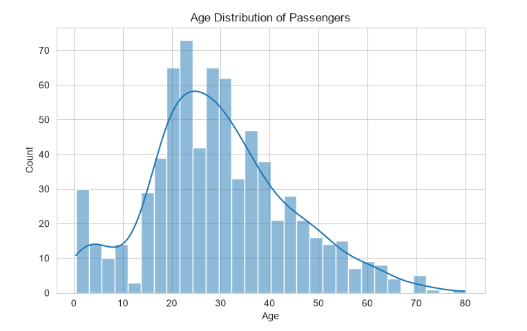
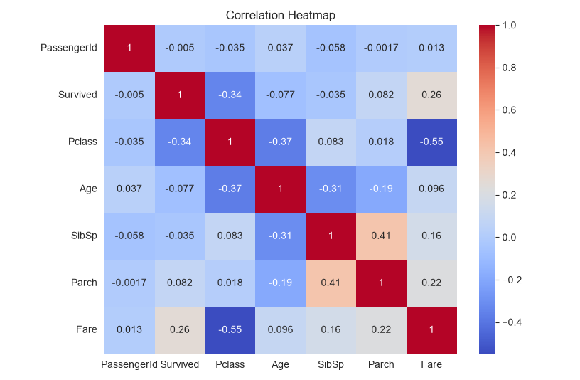
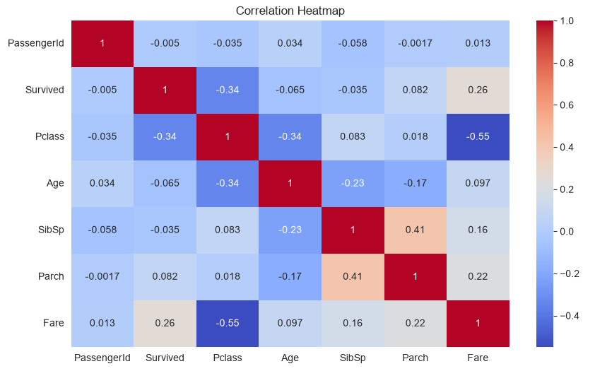
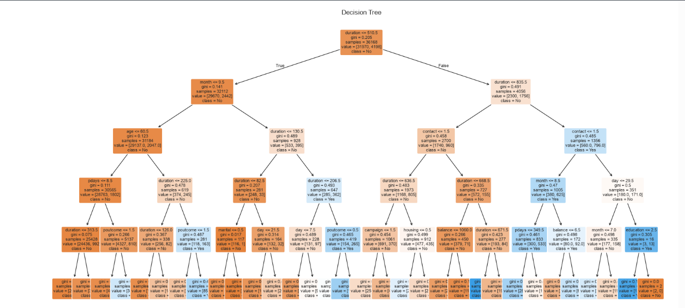
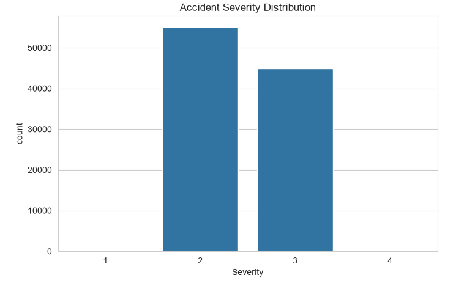
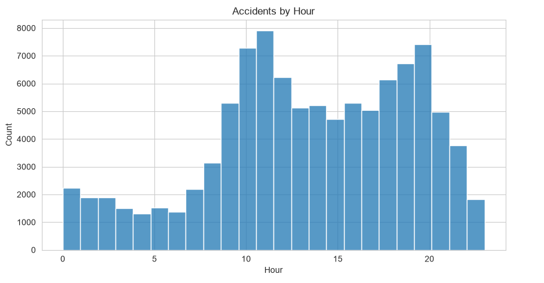
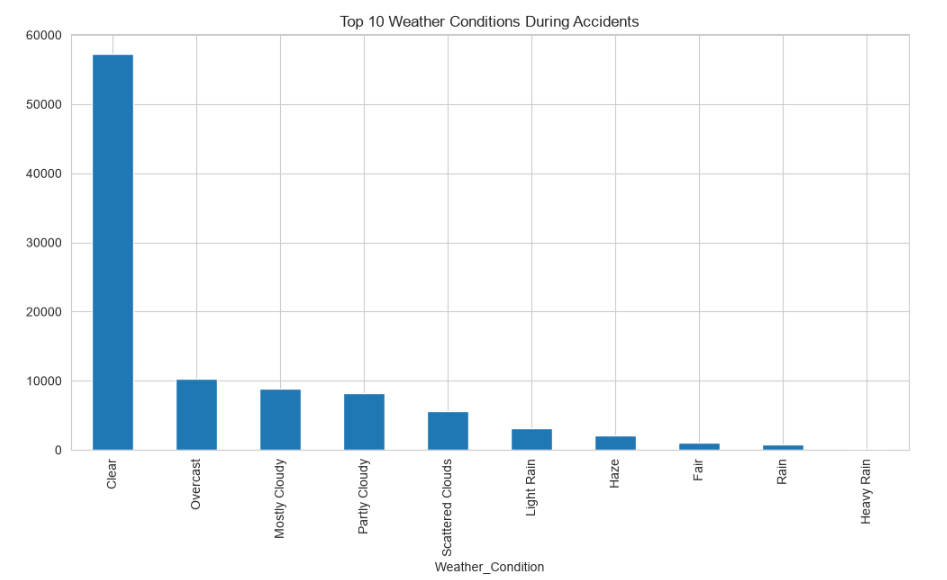

# 📊 Data Science Internship

A collection of data science internship tasks completed using Python, covering data visualization, exploratory data analysis (EDA), machine learning, and real-world accident data analysis.

---

## 📌 Project Overview

This repository contains the work completed during my **1-Month Data Science Internship**. The project demonstrates the complete data science workflow, including:

- Data Visualization
- Data Cleaning
- Exploratory Data Analysis (EDA)
- Feature Engineering
- Machine Learning using Decision Tree Classifier
- Real-world Data Analysis

---

## 🛠 Technologies Used

- Python 3
- Jupyter Notebook
- Pandas
- NumPy
- Matplotlib
- Seaborn
- Scikit-learn
- Git & GitHub

---

## 📂 Project Structure

```
Data-Science-Internship/
│
├── datasets/
│   ├── bank-full.csv
│   ├── iris.csv
│   ├── titanic.csv
│
├── notebooks/
│   ├── Task1_DataVisualization.ipynb
│   ├── Task2_EDA.ipynb
│   ├── Task3_DecisionTree.ipynb
│   └── Task4_US_Accidents_Analysis.ipynb
│
├── images/
│
├── report/
│
├── requirements.txt
├── .gitignore
└── README.md
```

---

# 📚 Tasks Completed

## ✅ Task 1 – Data Visualization

### Objective

Explore the Titanic dataset using different visualization techniques.

### Topics Covered

- Histogram
- Count Plot
- Bar Plot
- Box Plot
- Scatter Plot
- Correlation Heatmap

### Skills Learned

- Data Visualization
- Pattern Identification
- Correlation Analysis

---

## ✅ Task 2 – Data Cleaning & Exploratory Data Analysis

### Objective

Clean and preprocess the dataset before analysis.

### Topics Covered

- Missing Value Handling
- Duplicate Removal
- Label Encoding
- Feature Selection
- Statistical Summary

### Skills Learned

- Data Cleaning
- Feature Engineering
- Exploratory Data Analysis

---

## ✅ Task 3 – Decision Tree Classification

### Objective

Build a Machine Learning model to predict customer subscription using the Bank Marketing dataset.

### Workflow

- Data Preprocessing
- Label Encoding
- Train-Test Split
- Decision Tree Classifier
- Model Evaluation

### Evaluation Metrics

- Accuracy Score
- Confusion Matrix
- Classification Report
- Decision Tree Visualization

**Model Accuracy:** **87%**

---

## ✅ Task 4 – US Accidents Data Analysis

### Objective

Analyze accident trends using the US Accidents dataset.

### Analysis Performed

- Missing Value Analysis
- Accident Severity Distribution
- Accidents by Hour
- Accidents by Day
- Weather Condition Analysis
- Top Accident States
- Top Accident Cities
- Correlation Heatmap

### Key Insights

- Peak accident hours were identified.
- Most accidents were of moderate severity.
- Certain states recorded significantly higher accident counts.
- Weather conditions influenced accident occurrence.

---

# 📸 Project Outputs

---

## 📊 Task 1 – Data Visualization

### Histogram



### Box Plot


### Correlation Heatmap



---

## 🧹 Task 2 – Data Cleaning & EDA

### Scatter Plot


### Correlation Heatmap



---

## 🌳 Task 3 – Decision Tree Classification

### Decision Tree Visualization



---

## 🚗 Task 4 – US Accidents Analysis

### Accident Severity Distribution



### Accidents by Hour



### Weather Condition Analysis



# 📊 Libraries Used

```python
import pandas as pd
import numpy as np
import matplotlib.pyplot as plt
import seaborn as sns
from sklearn.model_selection import train_test_split
from sklearn.tree import DecisionTreeClassifier
```

---

# ▶️ How to Run

### Clone the repository

```bash
git clone https://github.com/ashribad2005/Data-Science-Internship.git
```

### Move into the project folder

```bash
cd Data-Science-Internship
```

### Install required libraries

```bash
pip install -r requirements.txt
```

### Open Jupyter Notebook

```bash
jupyter notebook
```

Open any notebook from the **notebooks/** folder and run the cells sequentially.

---

# 📁 Dataset Information

Datasets used in this project:

- Titanic Dataset
- Iris Dataset
- Bank Marketing Dataset
- US Accidents Dataset (March 2023)

> **Note:** The `US_Accidents_March23.csv` dataset is not included in this repository due to GitHub's file size limitations. It can be downloaded separately from Kaggle.

---

# 🎯 Learning Outcomes

Through this internship, I gained practical experience in:

- Data Visualization
- Data Cleaning
- Exploratory Data Analysis
- Machine Learning Fundamentals
- Decision Tree Classification
- Model Evaluation
- Git & GitHub Version Control
- Python for Data Science

---

# 🚀 Future Improvements

- Implement additional machine learning algorithms.
- Perform hyperparameter tuning.
- Build interactive dashboards.
- Deploy models using Flask or Streamlit.

---

# 👨‍💻 Author

**Ashribad**

GitHub: https://github.com/ashribad2005

---

## ⭐ If you found this project useful, consider giving it a star!
